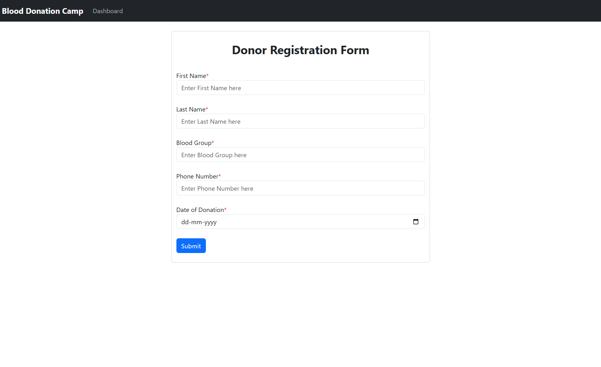

# 🩸 Blood Donation Camp Management System

A full-stack web application to manage blood donation camps. It simplifies donor registration, event management, and administrative control using **Spring Boot**, **Thymeleaf**, and **JPA**. Designed to be intuitive, secure, and responsive for both users and administrators.

---

## 📌 Table of Contents

- [Features](#-features)
- [Tech Stack](#-tech-stack)
- [Getting Started](#-getting-started)
- [Screenshots](#-screenshots)

---

## ✅ Features

- 📝 Donor registration with form validation
- 🔍 Admin dashboard for viewing and managing donor data
- 🗓️ Event scheduling for blood donation camps
- 📧 Email notifications (optional)
- 🧪 JPA-based data persistence with validation
- 📊 Statistics dashboard (optional/expandable)

---

## 🛠 Tech Stack

| Layer      | Technology                        |
|------------|-----------------------------------|
| Backend    | Java 21, Spring Boot              |
| Frontend   | HTML5, CSS3, Thymeleaf, Bootstrap |
| Database   | MySQL                             |
| ORM        | Hibernate (JPA)                   |
| Build Tool | Maven                             |

---

## 🚀 Getting Started

### 1. Clone the repository
```bash
git clone https://github.com/your-username/blood-donation-camp.git
cd blood-donation-camp


## 🖼️ Screenshots

[[!([landing_page.png](https://github.com/TanushreeShaw/Blood-Donation-Camp/blob/8da9a43e5b2fa5ea31e5d41b0b7f2b6c28745c0a/edit_page.png))

](https://github.com/TanushreeShaw/Blood-Donation-Camp/blob/8da9a43e5b2fa5ea31e5d41b0b7f2b6c28745c0a/edit_page.png)](https://github.com/TanushreeShaw/Blood-Donation-Camp/blob/8da9a43e5b2fa5ea31e5d41b0b7f2b6c28745c0a/edit_page.png)


